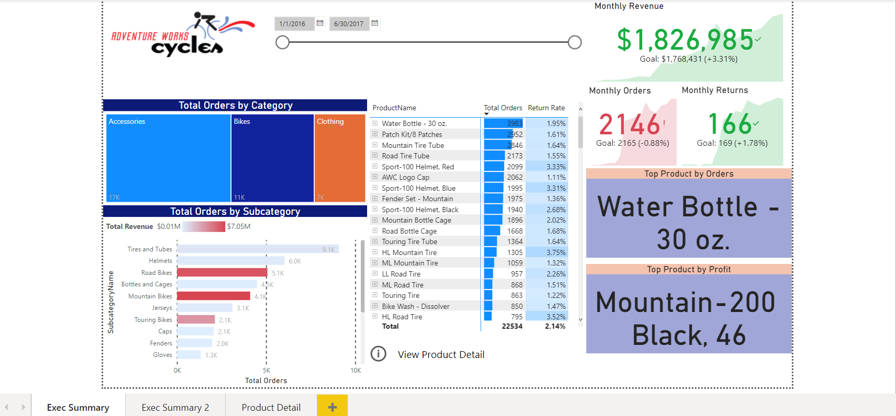
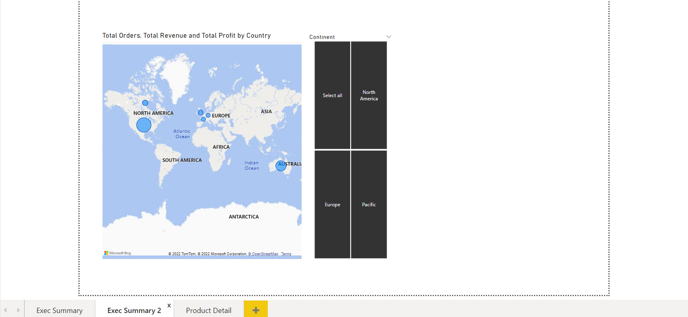

# AdventureWorks

Power BI project to track core business KPIs, like sales, revenues, profit and returns, but also compare regional performance across sales territories, analyze performance and trending at the product level, and forecast future profits and use the data to identify the company's high value customers.

---
## Dashboard demo

